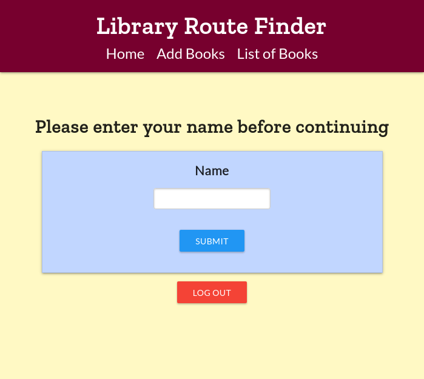
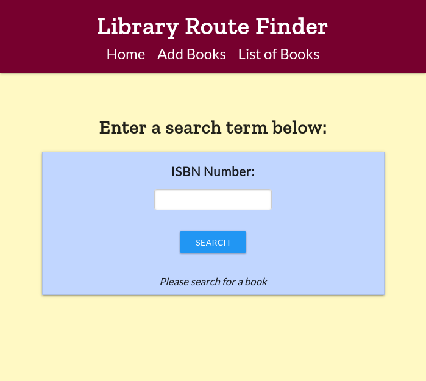

=========
For Users
=========

Application Purpose
===================

The purpose of the **Library Route Finder** is to make the retrieval of items
in the library. The deployment our team maintains (available
`here <https://route-finder.netlify.app>`_) uses the floor plans of
`Preus Library <https://luther.edu/library>`_ at Luther College for the purpose
of demonstration. Our stated goals for this project include improving the
experience of locating library materials, as well as minimizing distance
to walk if a patron or employee is visiting many shelves.

In addition to seeking to improve these real-world use cases in the realm
of library patron experience, we also envisioned this project as implementing
a portable concept. The idea of making the location of items within a library,
store, warehouse, etc. has positive potential for a wide range of people in the
areas of accessibility, orientation, and efficiency.

Getting Started
===============

Logging In
----------

The first step in using this program is to enter your name (or a username
of your choice) into the form on the home page:

Searching for a Book to Add
---------------------------

When you click "Log In" on the first page, you will be redirected to the Search
page. On this page is a form similar to the Login form, this time requesting an
ISBN (International Standard Book Number).

To add a book, simply enter its ISBN in the box provided, and click "Search".
The text below this button will update with a message indicating what book was
added to your list, or in the case of an error will communicate the issue.

Viewing the Booklist and Route
------------------------------

*To be added later*
